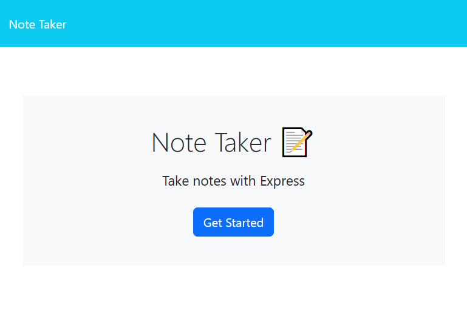
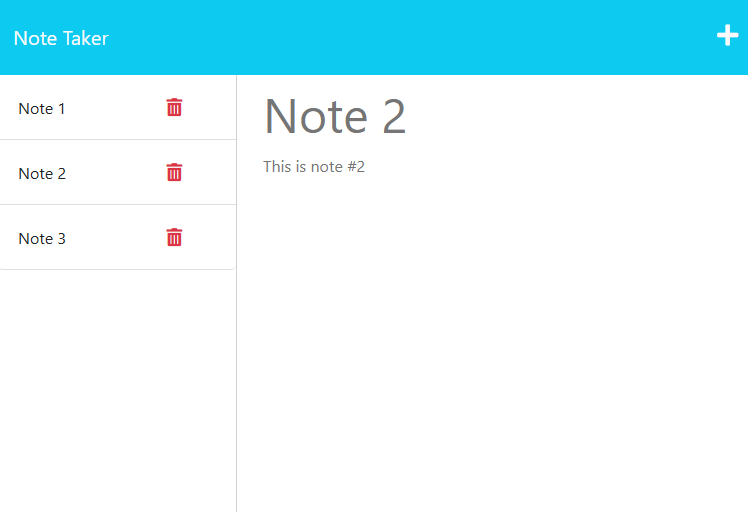

# note-taker-api [](https://opensource.org/licenses/MIT)

## Description

This challenge was to create an application called Note Taker that can be used to write and save notes with unique IDs.  It uses Express.js for the backend and retrieves notes data from a server-side JSON file.  The front-end code was cloned but I built the backend, connected the two, and deployed it to Heroku.

### User Story
```
AS A small business owner
I WANT to be able to write and save notes
SO THAT I can organize my thoughts and keep track of tasks I need to complete
```

### Acceptance Criteria
```
GIVEN a note-taking application

WHEN I open the Note Taker
THEN I am presented with a landing page with a link to a notes page

WHEN I click on the link to the notes page
THEN I am presented with a page with existing notes listed in the left-hand column, plus empty fields to enter a new note title and the note’s text in the right-hand column

WHEN I enter a new note title and the note’s text
THEN a Save icon appears in the navigation at the top of the page

WHEN I click on the Save icon
THEN the new note I have entered is saved and appears in the left-hand column with the other existing notes

WHEN I click on an existing note in the list in the left-hand column
THEN that note appears in the right-hand column

WHEN I click on the Write icon in the navigation at the top of the page
THEN I am presented with empty fields to enter a new note title and the note’s text in the right-hand column
```

## Table of Contents

- [Installation](#installation)
- [Usage](#usage)
- [License](#license)
- [Credits](#credits)
- [Questions](#questions)

## Installation

No install required - visit the live application at https://notezzz.herokuapp.com.

## Usage

Visit the above URL, then click "Get Started" to see notes.  Users can view old notes by clicking them, or add a new note by clicking the '+' sign in the upper right hand corner, followed by the save icon after entering a note title and text.  Users can also delete notes by clicking the red trashcan associated with the note.

### Screenshot of landing page (index.html)


### Screenshot of notes page (/notes)


## License

MIT License - Please refer to the LICENSE in the repo.

## Credits

This favicon was generated using the following font:

- Font Title: Rancho
- Font Author: Copyright (c) 2011 by Font Diner, Inc. All rights reserved.
- Font Source: http://fonts.gstatic.com/s/rancho/v17/46kulbzmXjLaqZRlbWXgd0RY1g.ttf
- Font License: Apache License, version 2.0 (http://www.apache.org/licenses/LICENSE-2.0.html))

## Questions

You can view my Github @ https://www.github.com/maximusDecimalusMeridius  
OR  
Email me with questions @ [andygg_dev@yahoo.com](mailto:andygg_dev@yahoo.com?subject=Question%20About%20note-taker-api%20App)
    